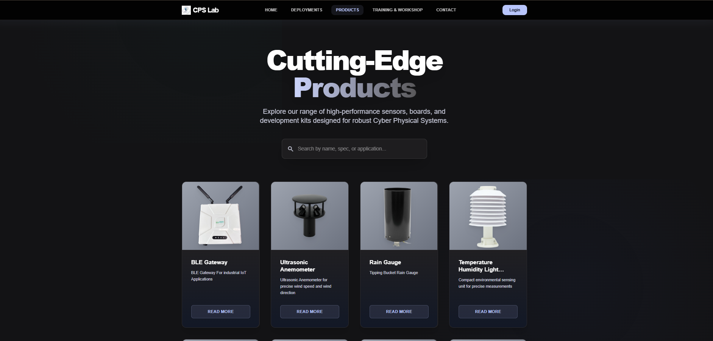
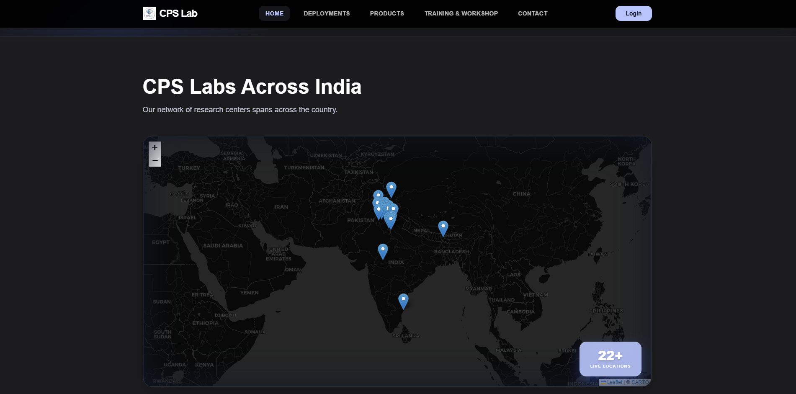
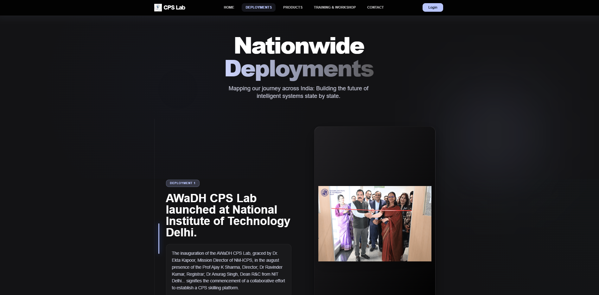

# CPS_LAB Web Application

Welcome to the **CPS_LAB** project! This is a modern, dynamic web application built with [Next.js](https://nextjs.org/). It is designed to provide an interactive and visually stunning user experience, featuring 3D visual elements, interactive maps, and seamless animations.

## ✨ Key Features

- **Immersive 3D Visuals**: Powered by `three.js` and `@react-three/fiber`.
- **Interactive Maps**: Utilizing `leaflet` and `react-leaflet` for dynamic, geographic data visualization.
- **Fluid Animations**: Smooth page transitions and element interactions with `framer-motion`.
- **Authentication System**: Secure user login and management handled by AWS Amplify.
- **Modern UI**: Styled with Tailwind CSS for a beautiful, responsive, and accessible interface.

---

## 📸 Screenshots

Here is a glimpse of the application's interface:

### Login Page


### Products Dashboard


### Interactive Maps


### Deployments Overview


### Impact Analysis


---

## 🚀 Getting Started

Follow these steps to run the project locally.

### Prerequisites

Ensure you have Node.js installed. Then, install the project dependencies:

```bash
npm install
```

### Running the Development Server

Start the development server with:

```bash
npm run dev
```

Open [http://localhost:3000](http://localhost:3000) with your browser to see the result. You can start editing the page by modifying `app/page.tsx` (or `src/app/page.tsx`). The page auto-updates as you edit the file.

## 🛠 Tech Stack

- **Framework**: [Next.js](https://nextjs.org/)
- **Styling**: [Tailwind CSS](https://tailwindcss.com/)
- **Icons**: [Lucide React](https://lucide.dev/)
- **Animations**: [Framer Motion](https://www.framer.com/motion/)
- **Maps**: [React Leaflet](https://react-leaflet.js.org/)
- **3D Graphics**: [Three.js](https://threejs.org/) & [React Three Fiber](https://docs.pmnd.rs/react-three-fiber/getting-started/introduction)
- **Auth**: [AWS Amplify](https://aws.amazon.com/amplify/)
